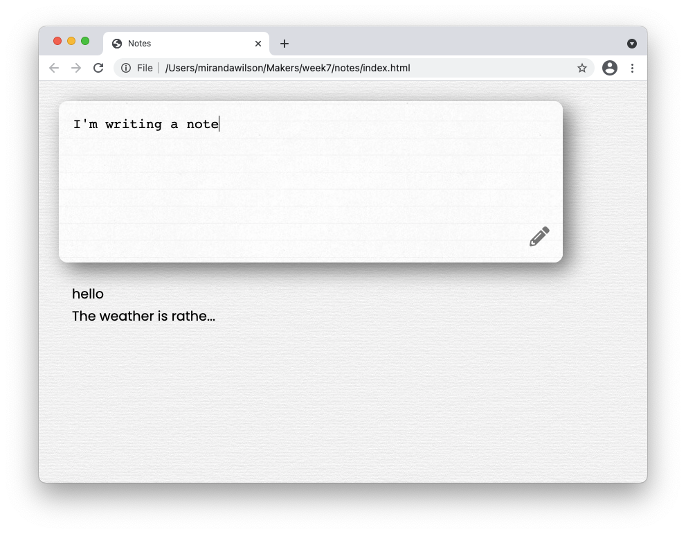
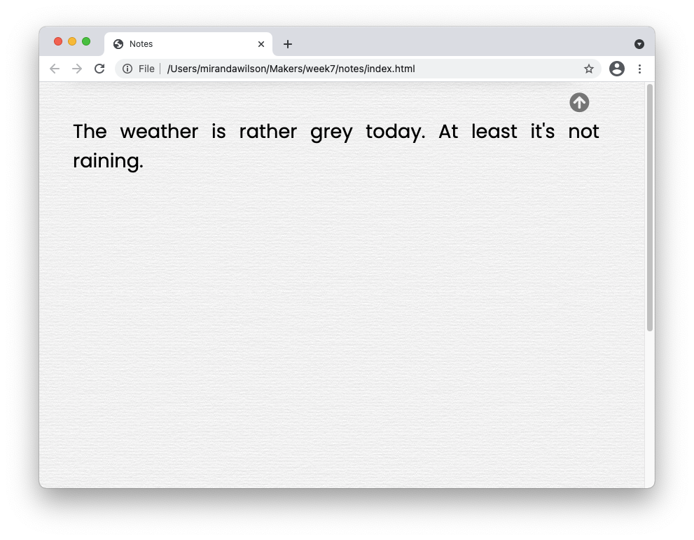

## Notes

A personal note-taking webapp, in vanilla JavaScript.


### Description
This was a team project for week 7 of the 12-week [Makers Academy](https://makers.tech) coding bootcamp. There was an extra challenge during this week: we were asked not to use any existing libraries. The goals were:  
* Practise JavaScript, HTML and CSS
* Learn how to interact with the DOM using vanilla JavaScript
* Create a Single Page App
* Create our own basic testing framework  

These were the user stories given:  
```
As a programmer
I can see a list of my notes, where each note is abbreviated to the first 20 characters
So I can find the one I want
```
```
As a programmer
I can create a new note
So I can record something I need to remember
```
```
As a programmer
I can see the full text of an individual note on its own page
So I can see all the information in the note
```
```
As a programmer
I can use shortcodes like `:fire:` that get converted into emojis like 🔥
So I can record notes with fun little pictures
```
```
As a programmer
I can refresh the page and still see my notes
So I can remember what I took down
```

Try it out [here](https://mscwilson.github.io/notes).  

It looks like this:  
  
  
  
### Technical Approach
This is a Single Page App, meaning that it uses JavaScript to alter the DOM to show different things on the page. The main view has a text area form to submit a note. Notes are managed by the Notebook class, which uses LocalStorage (similar to cookies) to store them in the browser.  

All the notes are shown in a list on the page. Longer notes are truncated, but all notes can be clicked on to view them individually.  
  
For the emoji shortcode translation specification, we used [an API provided by Makers Academy](https://makers-emojify.herokuapp.com/). It doesn't require an API key. 

### Installation and Usage
* Clone this repo and navigate into it
* Open `index.html` in your browser
* Write some notes for yourself
* To run the unit tests, open `SpecTest.html` in your browser
* View the Developer Tools Console on that page to see the results of the tests

### Contributors


### Known Issues
* The page was built using Chrome. It doesn't work properly on Firefox - clicking on an indivdual note doesn't do anything.
* There's currently no way to delete notes, aside from deleting all of them via LocalStorage.
